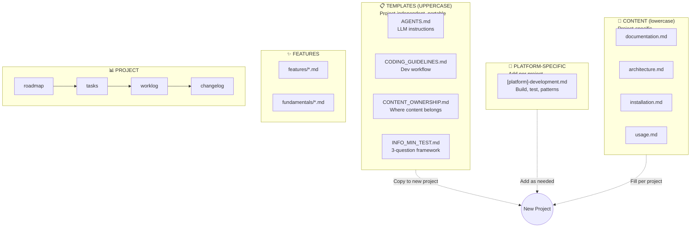

# Documentation Guide

## Overview

A **documentation template** optimized for AI-assisted development:

- **LLM-Friendly:** Structured for AI coding assistants with dedicated behavioral instructions
- **Feature-First:** Organized by what software does, not code structure
- **AI-Documented:** Designed for human + LLM collaboration
- **Portable:** Copy entire `docs/` folder to any project

## Core Principles

| Principle | Purpose | Implementation |
|-----------|---------|----------------|
| **Information Minimalism** | WHAT to document | 3-question test before adding any documentation |
| **Single Source of Truth** | WHERE to put it | Each fact lives in ONE place, reference don't duplicate |
| **Just-in-Time Reading** | WHEN to read it | Minimal upfront, situational references |
| **Template Portability** | HOW to organize | UPPERCASE = reusable templates, lowercase = project content |
| **Feature-First** | HOW to structure | Organize by what software does, not code structure |

### Information Minimalism Decision Flow

```mermaid
flowchart TD
    START([Need to document something?]) --> Q1{Q1: Would skilled<br/>developer need this?}
    Q1 -->|NO| SKIP[❌ Don't document]
    Q1 -->|YES| Q2{Q2: Obvious from<br/>code/structure/naming?}
    Q2 -->|YES| SKIP
    Q2 -->|NO| Q3{Q3: Does it duplicate<br/>existing content?}
    Q3 -->|YES| REF[🔗 Reference instead]
    Q3 -->|NO| DOC[✅ Document it]

    DOC --> WHERE{Where does it go?}
    WHERE -->|"Technology decisions"| ARCH[(architecture.md)]
    WHERE -->|"Setup steps"| INSTALL[(installation.md)]
    WHERE -->|"How to use"| USAGE[(usage.md)]
    WHERE -->|"Feature deep-dive"| FEAT[(features/*.md)]
    WHERE -->|"Core concept"| FUND[(fundamentals/*.md)]
    WHERE -->|"Platform-specific"| PLAT[([platform]-development.md)]
    WHERE -->|"Release notes"| CHANGE[(changelog.md)]
```

### Structure Overview



## File Naming Convention

**UPPERCASE** = Template/meta/reference files (describe structure, not content):
- `README.md` - Meta descriptions (what something IS FOR)
- `AGENTS.md`, `CODING_GUIDELINES.md` - Templates for all projects
- `CONTENT_OWNERSHIP.md` - Reference guide
- `INFO_MIN_TEST.md` - Decision framework (shareable)
- `VALIDATION.md` - Quality validation checklist
- `features/TEMPLATE.md` - Feature structure guide

**lowercase** = Content files (actual project data):
- `documentation.md` - Curated overview of what software does
- `architecture.md`, `installation.md`, `usage.md`, `testing.md`
- `project/roadmap.md`, `project/tasks.md`, `project/worklog.md`, `project/changelog.md`
- `features/[name].md`, `fundamentals/[topic].md`

**Rule:** UPPERCASE = describes structure/process, lowercase = actual content

## Feature-Driven Approach

**Organize by features (what software does), not code structure (how it's built).**

- `features/` - Cross-cutting features, user-facing functionality, complete workflows
- `fundamentals/` - Core concepts, architectural patterns, domain knowledge

**Examples:**
- ✅ `features/translation-pipeline/` - How translation works across components
- ✅ `fundamentals/manual-types.md` - Concept of manual types
- ❌ `backend/translator.md` - Code-driven (avoid)

**For complex features:** See [features/TEMPLATE.md](features/TEMPLATE.md) for folder structure guide

**Note:** For projects with extensive testing needs, expand `testing.md` → `testing/` folder (strategy.md, coverage.md, e2e.md, etc.)


## Complete Structure

```
PROJECT_ROOT/
├── README.md                     # Project overview (manual, project-specific)
│
└── docs/
    ├── README.md                 # This file - documentation guide
    │
    │   # Templates (project-independent, portable)
    ├── AGENTS.md                 # LLM behavioral instructions
    ├── CODING_GUIDELINES.md      # Development and documentation rules
    ├── CONTENT_OWNERSHIP.md      # Detailed ownership reference
    ├── INFO_MIN_TEST.md          # 3-question test for what to document
    ├── VALIDATION.md             # Quality validation checklist
    │
    │   # Platform-specific (add per project)
    ├── [platform]-development.md # Platform build, test, patterns
    │   # Examples: android-development.md, ios-development.md, python-development.md
    │
    │   # Content files (project-specific)
    ├── documentation.md          # Curated overview - what software does
    ├── architecture.md           # System design & tech stack
    ├── installation.md           # Setup and prerequisites
    ├── usage.md                  # Usage guide and key files
    ├── testing.md                # Testing guide
    │
    ├── features/                 # Feature-driven documentation
    │   ├── TEMPLATE.md           # Feature folder structure guide
    │   ├── [feature].md          # Simple feature (single file)
    │   └── [feature]/            # Complex feature (folder)
    │       ├── README.md         # Feature overview
    │       ├── implementation.md # How it's implemented
    │       └── examples.md       # Usage examples
    │
    ├── fundamentals/             # Core concepts
    │   └── [topic].md            # Fundamental topics
    │
    └── project/                  # Project management
        ├── README.md             # Meta: what this folder is FOR
        ├── roadmap.md            # Strategic planning (quarters/years)
        ├── tasks.md              # Approved work (ready to start)
        ├── worklog.md            # Daily execution (session logs)
        └── changelog.md          # Release history (shipped features)
```

### File Types

| Type | Files | Purpose |
|------|-------|---------|
| **Templates** (UPPERCASE) | AGENTS.md, CODING_GUIDELINES.md, etc. | Project-independent, reusable across projects |
| **Platform-specific** (lowercase) | `[platform]-development.md` | Build commands, patterns for specific platform |
| **Content** (lowercase) | architecture.md, features/*.md | Project-specific documentation |
| **Project management** | project/*.md | Planning, tracking, changelog |

## Content Ownership

**Principle:** Each piece of information lives in **exactly ONE location**. Reference, never duplicate.

**Detailed ownership table:** See [CONTENT_OWNERSHIP.md](CONTENT_OWNERSHIP.md)

---

## Using with GitHub

**docs/project tracks the complete workflow:**

**Workflow:** PLAN → APPROVE → EXECUTE → DELIVER → DOCUMENT

- `roadmap.md` - Strategic planning (quarterly goals, major initiatives)
- `tasks.md` - Approved work queue (concrete tasks ready to start)
- `worklog.md` - Daily execution (session logs, blockers, progress)
- `changelog.md` - Release history (shipped features after PR merge)

**Process:**
1. Plan → Add to roadmap.md
2. Approve → Discuss → Add to tasks.md
3. Execute → Work → Log in worklog.md
4. Deliver → PR → Merge
5. Document → Remove from tasks.md → Add to changelog.md

**Complements GitHub:** Issues for bugs, Projects for sprint planning, PRs for review

---

## Documentation Standards

**Writing Style:** Follow [Google Developer Documentation Style Guide](https://developers.google.com/style)
- Clear, concise, active voice
- Present tense, second person ("you")
- Avoid jargon unless project-specific

**Content Scope:** Information Minimalism
- Document only what skilled developers need to reconstruct the project
- Skip obvious details any experienced engineer would know
- Focus on project-specific decisions and tribal knowledge
- See [CODING_GUIDELINES.md - Core Principle](CODING_GUIDELINES.md#core-principle)

**Architecture:** Inspired by [Arc42](https://arc42.org/) structure
- Technology decisions with rationale
- System architecture and data flow
- Business rules and design decisions

---

**Last Updated:** 2025-12-21
