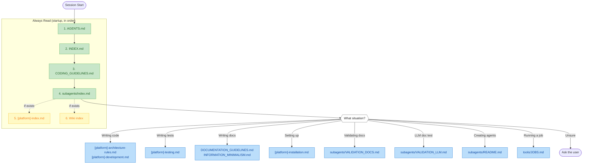

# Documentation

<!-- This is the docs/ folder entry point for adopting projects.
     The root README.md describes aiDocs itself. This file describes YOUR project's docs. -->

Development guidelines and templates (lives in repo).

**LLMs:** Start at [AGENTS.md](AGENTS.md)

**Navigation:** See [INDEX.md](INDEX.md) for full contents


## Project

**Name:** [Your Project Name]

**Description:** [Brief description of what your project does]

**Audience:** Developers and LLMs


## Data Flow: LLM File Reading Order

How files are loaded — mandatory reads first (sequential), then situational reads on demand:


```mermaid
flowchart TD
    START([Session Start]) --> M1

    subgraph startup ["Always Read (startup, in order)"]
        M1["1. AGENTS.md"] --> M2["2. INDEX.md"]
        M2 --> M3["3. CODING_GUIDELINES.md"]
        M3 --> M4["4. subagents/index.md"]
        M4 -.->|if exists| M5["5. [platform]-index.md"]
        M4 -.->|if exists| M6["6. Wiki index"]
    end

    M4 --> SIT{{"What situation?"}}

    SIT -->|"Writing code"| CODE["[platform]-architecture-rules.md<br>[platform]-development.md"]
    SIT -->|"Writing tests"| TEST["[platform]-testing.md"]
    SIT -->|"Writing docs"| DOCS["DOCUMENTATION_GUIDELINES.md<br>INFORMATION_MINIMALISM.md"]
    SIT -->|"Setting up"| SETUP["[platform]-installation.md"]
    SIT -->|"Validating docs"| VDOC["subagents/VALIDATION_DOCS.md"]
    SIT -->|"LLM doc test"| VLLM["subagents/VALIDATION_LLM.md"]
    SIT -->|"Creating agents"| AREADME["subagents/README.md"]
    SIT -->|"Running a job"| JOBS["tools/JOBS.md"]
    SIT -->|"Unsure"| USER(["Ask the user"])

    classDef always fill:#c8e6c9,stroke:#4caf50,color:#1b5e20
    classDef optional fill:#fff9c4,stroke:#fbc02d,color:#f57f17
    classDef conditional fill:#bbdefb,stroke:#1976d2,color:#0d47a1
    classDef decision fill:#fff,stroke:#616161,color:#212121

    class M1,M2,M3,M4 always
    class M5,M6 optional
    class CODE,TEST,DOCS,SETUP,VDOC,VLLM,AREADME,JOBS conditional
    class SIT decision
```

Green = always read | Yellow = read if exists | Blue = read when situation occurs

Skills also load their `SKILL.md` from `.claude/skills/` — see [AGENTS.md](AGENTS.md) Skills section.


## Wiki

**Location:** [GitHub Wiki](../../wiki)

**Access:**
```bash
# Clone wiki for local editing (GitHub)
gh repo clone [org]/[repo].wiki

# Or via git
git clone https://github.com/[org]/[repo].wiki.git
```

**Index file:** See [wiki.md](wiki.md) for wiki setup and index file location

**File organization:**
- File naming: `[section]-[topic].md` (e.g., `architecture-overview.md`, `features-authentication.md`)
- Sidebar uses H2 (`##`) for sections, links for pages

**Alternative locations:**
- GitHub Wiki: `../../wiki` or `https://github.com/[org]/[repo]/wiki`
- Confluence: `https://[company].atlassian.net/wiki/spaces/[space]`
- Notion: `https://notion.so/[workspace]/[page]`